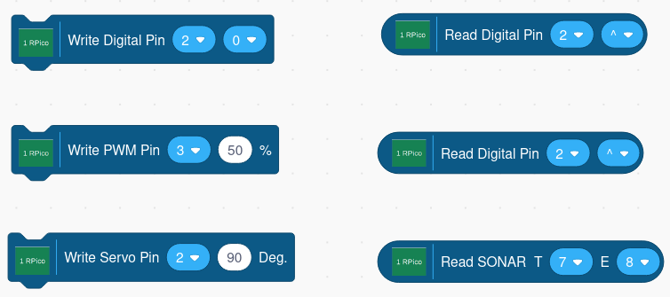
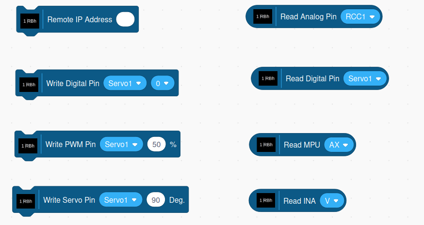

# Scratch 3 With OneGPIO Extensions

## The online version is launchable [here.](https://mryslab.github.io/s3onegpio/)

## Quick Intallation Intructions:

* For Arduino, Circuit Playground Express, ESP32, ESP-8266, Robohat-MM1, and Raspberry Pi
  Pico boards, install the server firmware. See the
  [Preparing Your Micro-Controller](https://mryslab.github.io/s3-extend/) section
  of the User's Guide.

* Launch the Scratch3 Editor using either the online or offline sites described
  in the [Ready, Set, Go/Launch The Scratch3 Editor](https://mryslab.github.io/s3-extend/)
  section of the User's Guide.

* Select your extension and start coding!.

## Read the [Installation And Usage Guide.](https://mryslab.github.io/s3-extend/)

## Raspberry Pi Pico Blocks

## Arduino Blocks

## ESP-8266 Blocks

## Raspberry Pi Blocks

## Picoboard Blocks

## RoboHAT MMI Blocks

# SPECIAL NOTE FOR BUILDING
Make sure you are using:

npm 9.6.3

nodejs v19.9.0

yarn 1.22.19