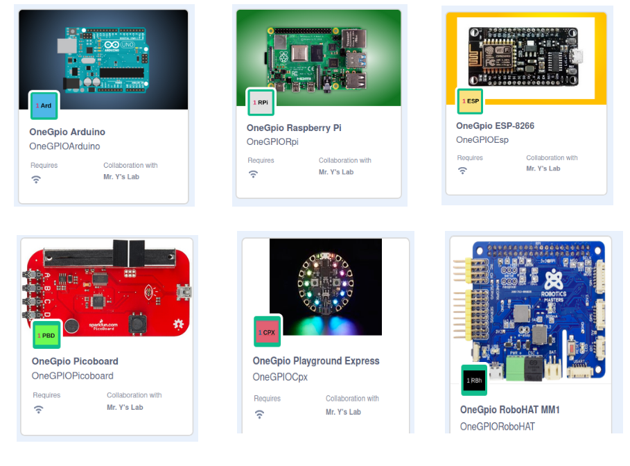
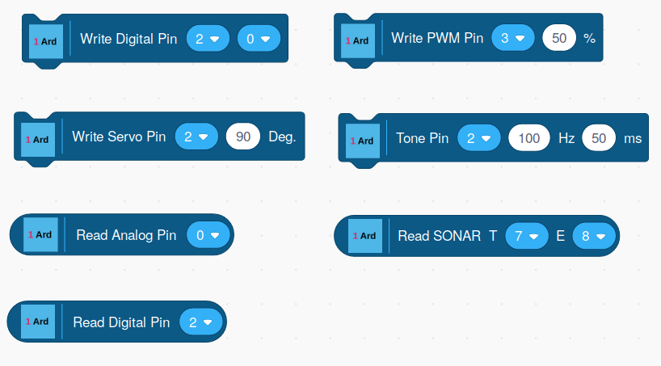
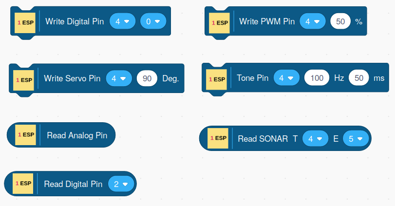
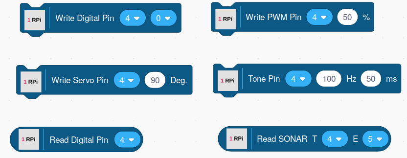
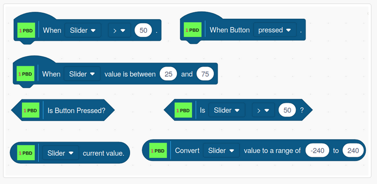

# Scratch 3 With OneGPIO Extensions

## The online version is launchable [here.](https://mryslab.github.io/s3onegpio/)

## Read the [Installation And Usage Guide.](https://mryslab.github.io/s3-extend/)

## Arduino Blocks

## ESP-8266 Blocks

## Raspberry Pi Blocks

## Picoboard Blocks

